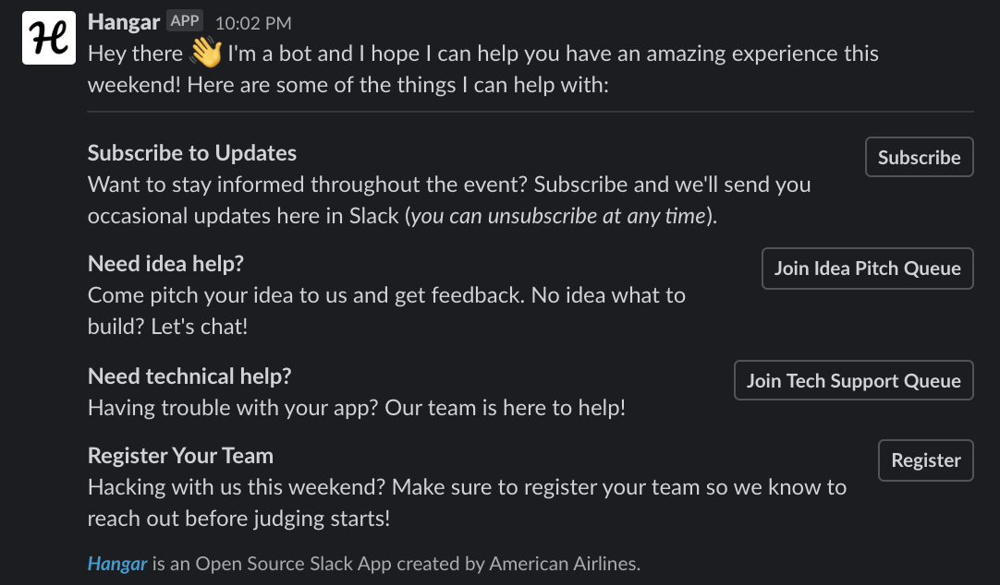
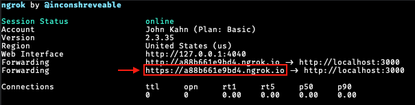

 
Sponsoring a student hackathon? You've come to the right place! American Airlines loves to help students learn new tech and we're passionate about being a big part of hackathons.

Whether you need help with judging which hack did the best job of tackling your challenge, you want to connect with students who need help, or you want to recruit students and capture resumes, *_Hangar_* will make your experience easy and enjoyable for everyone.

If you need insipiration for challenges, check out some of [our past challenges](https://github.com/AmericanAirlines/Flight-Engine/wiki).

#### :warning: Work in Progress
This app is still in the early stages of development and only some functionality is currently available. If you want to help expedite our development, [become a contributor](./.github/CONTRIBUTING.md)!

<!-- TODO: Add section here to redirect to the pages site if they're interested in using this for an event -->

---

# Getting Started
  1. [Local Development](#local-development)
  1. [Customizing Hangar](#customizing-hangar)
  1. [CI/CD](#cicd)
  1. [Contributing](#contributing)

---

# Local Development

## Node
Hangar uses Node.js as its runtime. To use the Hangar, you'll need to [download](https://nodejs.org/en/) and install the LTS (Long Term Support) version, which is currently 12.x. If you decide to use another version of Node such as 13.x or 14.x, you may experience unexpected issues.

## Postgres
Hangar uses Postgres 11, so you'll need to set it up on your machine. If you don't have Postgres installed already, see the [Installation and Use](#installation-and-use) section below. 

Create a database (we suggest `hangar`, if you chose something else or are running your server on a different port, make sure to create a `DATABASE_URL` value in `.env` with your override URL) in the PostgreSQL 11 server (do not make a new server), and then run the app. If your Postgres server is protected by a password, you'll need to add `PGUSER` and `PGPASSWORD` to your `.env` file where `PGUSER` will be `postgres` and `PGPASSWORD` will be the Postgres server password entered during installation.

When the app is deployed to a cloud environment, the `DATABASE_URL` `.env` var will be used (and is automatically set in Heroku when an associated service is connected to your app).

### Installation and Use
#### macOS
We recommend using [Postgres.app](https://postgresapp.com/) as the installation doesn't require a password and is generally easier to use that the traditional Postgres app below.

#### Windows/macOS/Linux
During the installation process (if you follow the steps on [postgresql.org](https://www.postgresql.org/download/)), you will be prompted to set a password - make sure to use something you'll remember.

#### Viewing/Editing the DB
If you'd like a visual way of viewing or editing your local database, try using [TablePlus](https://tableplus.com).

## Starting the App
The best way to start the app and work on it is by using `npm run dev`, which will start the app and then restart the app whenever a TypeScript file changes. After modifying a non-Typescript file, restart the app by typing `rs` into the same terminal you ran `npm run dev` from and then hitting return.

After the app starts, it will be accessible on `localhost:3000` (unless the port was modified via `.env`).

## Handling App Events Locally
In order to make your app accessible to platforms like Slack, you'll need to use an app like [`ngrok`](https://github.com/bubenshchykov/ngrok) to obtain a URL which can be used within your Slack app configuration. After running `npm i` to install dependencies, simply `npm run tunnel` to create the tunnel, then use the following URL output to route web traffic to your app.

## Creating a Slack App
Before you can use Hangar, you'll need to create a Slack app. Follow our [instructions for creating an app](./src/slack/README.md#initial-setup). Once you're done with the first section, continue below.

## Completing Your Configuration
Once your app is running, copy your app's URL and complete the [final configuration of your Slack app](./src/slack/README.md#after-deploying-hangar).

## Advanced

### Database Changes
If database schema is changed, the migrations must be changed accordingly. After starting the app (or using `npm run typeorm migration:run`), make changes to files in the `src/entities` directory as needed and then run `npm run typeorm migration:generate -- -n MigrationName` where `MigrationName` is the name of the migration (without the timestamp).

### Migrations
Do not update or remove an existing migration, as this can cause unexpected issues with local and production data. All database schema changes must be made in a new migration.

---

# Customizing Hangar
If you'd like to customize the app, fork this repo. If you have an idea for something and you'd like to contribute back to this project, [create a new Feature request](../../../issues/new?template=feature_request.md). If we like your suggestion, we'll ask you to open a Pull Request. For more details, check out our [Contributing Guidelines](./.github/CONTRIBUTING.md).

When you're ready to deploy your app, simply change the URL for the `Deploy to Heroku` button then merge it into your `main` branch. Once your repo is updated, just use that button you'll be good to go!

<!-- TODO: After the front end display for help queue is created, describe overriding the template here -->

---

# CI/CD
This project uses GitHub Actions for Continuous Integration and leverages Heroku for Continuous Deployment.

If you fork this project, deploy your app using the `Deploy to Heroku` button above, then navigate to the `Deploy` tab of your app in Heroku and configure Continuous Deployment as relevant for your app.

## Github Secrets
This project uses GitHub Secrets which ensure that certain environment variables are encrypted and securely stored for use in GitHub Actions. In order to create a secret, go to the settings tab in your GitHub Repository, and click on the secrets tab. Here you can set a secret by clicking `New Secret` and adding the secret name in addition to its value. Within workflows, the values can be utilizes with the following syntax: `${{ secrets.YOUR_SECRET }}`.

### CodeCov
The secret in used for CodeCov should be named `CODECOV_TOKEN`, and the value of this token will be the `Upload Token` generated when linking CodeCov to your Hangar repo. Secret values can also be updated in the secrets tab.

If you need help setting up CodeCov, instructions to do so can be found at [the CodeCov website](https://docs.codecov.io/docs/quick-start).
---

# Contributing
Interested in contributing to the project? Check out our [Contributing Guidelines](./.github/CONTRIBUTING.md).
