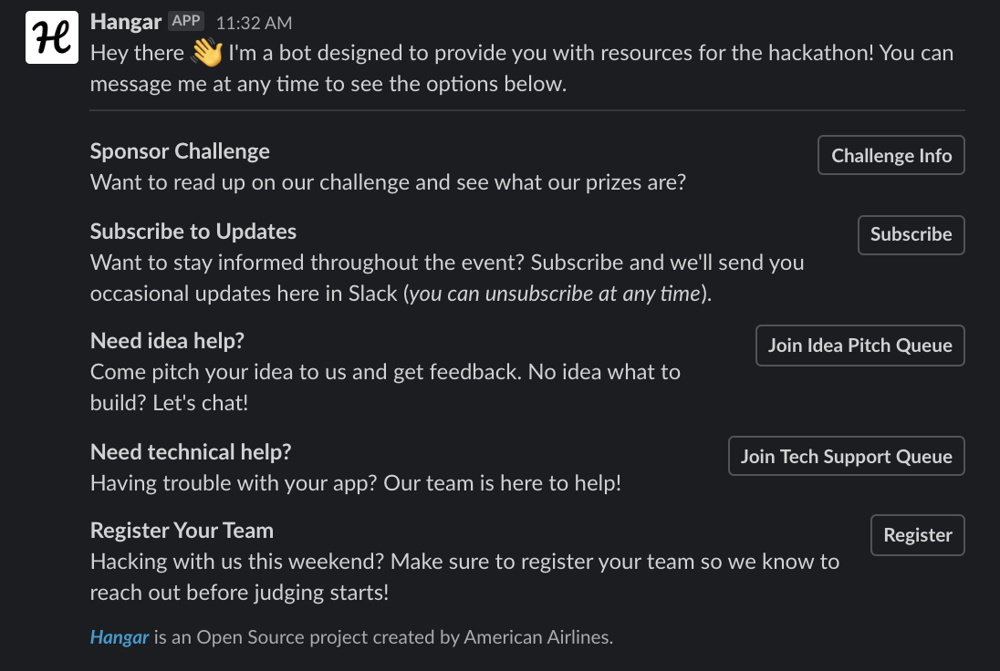

<p align="center">
  
  <br />
  <br />
  <a href="https://opensource.org/licenses/MIT">
    
  </a>
  
  <a href="https://codecov.io/gh/AmericanAirlines/Hangar">
    
  </a>
  <a href="https://lgtm.com/projects/g/AmericanAirlines/Hangar/alerts/">
    
  </a>
  <a href="https://lgtm.com/projects/g/AmericanAirlines/Hangar/context:javascript">
    
  </a>

  <center width="400">
    Sponsoring a student hackathon? You've come to the right place! American Airlines loves to help students learn new tech and we're passionate about being a big part of hackathons.
  </center>
</p>

---

### :warning: `v2.x` is in Development!

We've decided to take Hangar in a new direction and are working on the next generation of the platform. Check out the [`v2`](../../tree/v2) branch if you're interested!

---

## Hangar `v1.x`

Whether you need help with judging which hack did the best job of tackling your challenge, you want to connect with students who need help, or you want to recruit students and capture resumes, _*Hangar*_ will make your experience easy and enjoyable for everyone.



If you need inspiration for challenges, check out some of [our past challenges](https://github.com/AmericanAirlines/Flight-Engine/wiki).

---

## Getting Started

1. [Local Development](#local-development)
1. [Customizing Hangar](#customizing-hangar)
1. [CI/CD](#cicd)
1. [Contributing](#contributing)

---

# Local Development

## Prerequisites

### Node 14

Hangar uses Node.js as its runtime. To use the Hangar, you'll need to [download](https://nodejs.org/en/) and install the LTS (Long Term Support) version, which is currently 14.x.

:warning: If you decide to use another version of Node, such as 13.x or 15.x, you may experience unexpected issues.

### Yarn v1

Hangar is setup as a monorepo, so we need to be able to manage dependencies effectively with multiple packages. For this, we've chosen Yarn. You'll need to [download](https://classic.yarnpkg.com/en/docs/install) that and use it for this project.

> _Yarn replaces npm in this project_

## Postgres

Hangar uses Postgres for a database, so you'll need to set it up on your machine. If you don't have Postgres installed already, see the `Installation and Use` section below.

<details>
  <summary><strong>Installation and Use</strong></summary>

#### macOS

We recommend using [Postgres.app](https://postgresapp.com/) as the installation doesn't require a password and is generally easier to use that the traditional Postgres app below.

#### Windows/macOS/Linux

During the installation process (if you follow the steps on [postgresql.org](https://www.postgresql.org/download/)), you will be prompted to set a password - make sure to use something you'll remember.

#### Viewing/Editing the DB

If you'd like a visual way of viewing or editing your local database, try using [TablePlus](https://tableplus.com).

</details>

### Database Setup

Create a database (we suggest naming it `hangar`, if you chose something else or are running your server on a different port, make sure to create a `DATABASE_URL` value in `.env` with your override URL) in the PostgreSQL server, and then run the app. If your Postgres server is protected by a password, you'll need to add `PGUSER` and `PGPASSWORD` to your `.env` file where `PGUSER` will be `postgres` and `PGPASSWORD` will be the Postgres server password entered during installation.

When the app is deployed to a cloud environment, the `DATABASE_URL` `.env` var will be used (and is automatically set in Heroku when an associated service is connected to your app).

## Setup

1.  Install dependencies

    ```zsh
    yarn
    ```

1.  Copy `packages/api/.env.sample` to `packages/api/.env.local`

    ```zsh
    cp packages/api/.env.sample packages/api/.env.local
    ```

1.  Run the setup script

    ```zsh
    yarn setup
    ```

    > This script will build any required files so that the two packages (api and web) can work together

1.  Start the development server

    ```zsh
    yarn dev
    ```

    When you see this success message, open the url to load the site

    ```zsh
    🚀 Listening at http://localhost:3000
    ```

    > The server starts before Next.js finishes compiling, so the first time may take a little bit to load

1.  Start developing

## Learn More

To learn more about Next.js, take a look at the following resources:

- [Next.js Documentation](https://nextjs.org/docs) - learn about Next.js features and API.
- [Learn Next.js](https://nextjs.org/learn) - an interactive Next.js tutorial.

## Contributing

Interested in contributing to the project? Check out our [Contributing Guidelines](./.github/CONTRIBUTING.md).
