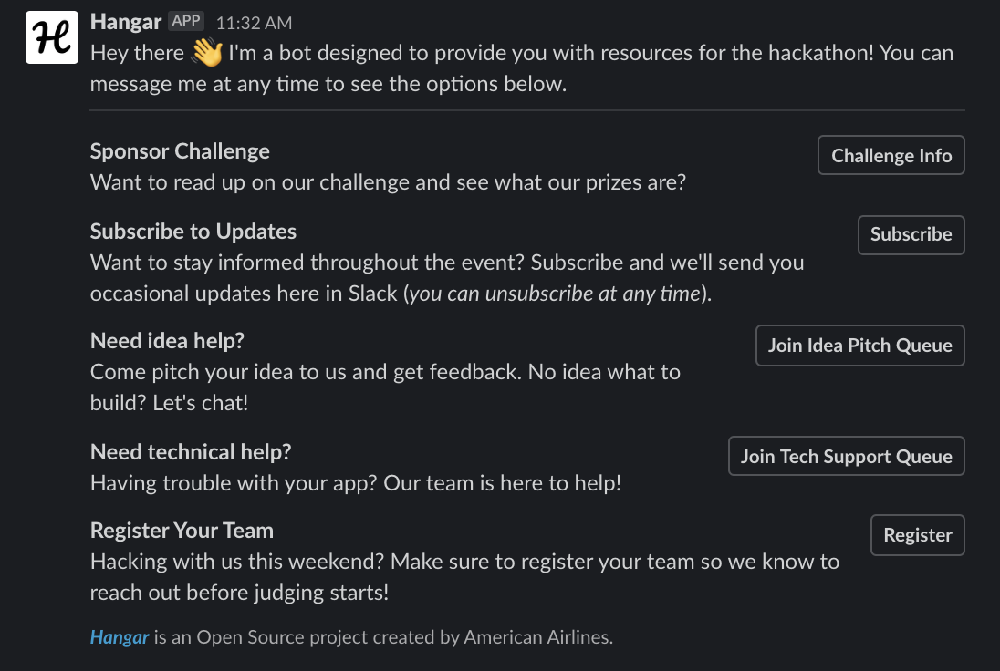

 
Sponsoring a student hackathon? You've come to the right place! American Airlines loves to help students learn new tech and we're passionate about being a big part of hackathons.

Whether you need help with judging which hack did the best job of tackling your challenge, you want to connect with students who need help, or you want to recruit students and capture resumes, *_Hangar_* will make your experience easy and enjoyable for everyone.

If you need insipiration for challenges, check out some of [our past challenges](https://github.com/AmericanAirlines/Flight-Engine/wiki).

#### Work in Progress
This app is still in the early stages of development and only some functionality is currently avaiable. If you want to help expedite our development, [become a contributor](https://github.com/AmericanAirlines/Hangar/blob/main/.github/CONTRIBUTING.md)!

# Using Hangar
You don't need to be technical to create your own instance of Hangar. Follow they steps below and you'll be up and running in less than 5 minutes!

## Creating a Slack App
Before you can use Hangar, you'll need to create a Slack app. Follow our [instructions for creating an app](https://github.com/AmericanAirlines/Hangar/blob/main/src/slack/README.md). Once you're done with the first section, continue below.

## Deploying Hangar to Heroku
Once your Slack app is up and running, click the button below and complete the form using your Slack secrets.

## Completing Your Configuration
Once your app is running, copy your app's URL and complete the [final configuration of your Slack app](https://github.com/AmericanAirlines/Hangar/blob/main/src/slack/README.md#after-deploying-hangar).

## Customizing Hangar
If you'd like to customize the app, fork this repo. If you have an idea for something and you'd like to contribute back to this project, [create a new Feature request](https://github.com/AmericanAirlines/Hangar/blob/main/.github/ISSUE_TEMPLATE/feature_request.md). If we like your suggestion, we'll ask you to open a Pull Request. For more details, check out our [Contributing Guidelines](https://github.com/AmericanAirlines/Hangar/blob/main/.github/CONTRIBUTING.md).

When you're ready to deploy your app, simply change the URL for the `Deploy to Heroku` button then merge it into your `main` branch. Once your repo is updated, just use that button you'll be good to go!

<!-- After the front end display for help queue is created, describe overriding the template here -->

## CI/CD
This project uses GitHub Actions for Continuous Integration and leverages Heroku for Continuous Deployment.

If you fork this project, deploy your app using the `Deploy to Heroku` button above, then navigate to the `Deploy` tab of your app in Heroku and configure Continuous Deployment as relevant for your app.

# Local Development
Hangar uses Postgres 11, so you'll need to set it up on your machine, create a database (we suggest `hangar`, if you chose something else or are running your server on a different port, make sure to create a `DATABASE_URL` value in `.env` with your override URL), and then run the app. When the app is deployed to a cloud environment, the `DATABASE_URL` `.env` var will be used (and is automatically set in Heroku when an associated service is connected to your app).

## Database Changes
If database schema is changed, the migrations must be changed accordingly. After starting the app (or using `npm run typeorm migration:run`), make changes to files in the `src/entities` directory as needed and then run `npm run typeorm migration:generate -- -n MigrationName` where `MigrationName` is the name of the migration (without the timestamp).

## Migrations
Do not update or remove an existing migration, as this can cause unexpected issues with local and production data. All database schema changes must be made in a new migration.

# Contributing
Interested in contributing to the project? Check out our [Contributing Guidelines](https://github.com/AmericanAirlines/Hangar/blob/main/.github/CONTRIBUTING.md).