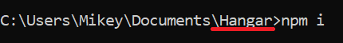

 
Sponsoring a student hackathon? You've come to the right place! American Airlines loves to help students learn new tech and we're passionate about being a big part of hackathons.

Whether you need help with judging which hack did the best job of tackling your challenge, you want to connect with students who need help, or you want to recruit students and capture resumes, *_Hangar_* will make your experience easy and enjoyable for everyone.

If you need insipiration for challenges, check out some of [our past challenges](https://github.com/AmericanAirlines/Flight-Engine/wiki).

#### Work in Progress
This app is still in the early stages of development and only some functionality is currently avaiable. If you want to help expedite our development, [become a contributor](https://github.com/AmericanAirlines/Hangar/blob/main/.github/CONTRIBUTING.md)!

  

# Hangar Setup (Technical)
If you're more comfortable with technical documentation, you can find the original README [here](https://github.com/AmericanAirlines/Hangar/blob/main/README.md).
  

# Hangar Setup for Dummies
You don't need to be technical to create your own instance of Hangar. This guide is designed to walk you through every step necessary to set things up, and includes a visual element to help along anyone who is uncomfortable with technology.

If you're more confident in your technical abilities, feel free to skip to the more succinct section titled **Hangar Setup (Technical)** down below.

## Grabbing the files
You might be reading this on the GitHub docs site and be wondering how to get the files yourself. If you have git installed or are comfortable cloning a git repository, we highly recommend doing so, but if you're short on time or simply want to test out the app quickly, then you can download a zip file containing everything directly from the GitHub page. We'll assume that anyone who can clone the repository has done so, and the rest of this section will be catered toward those who want to keep things as simple as possible.

Head over to the AmericanAirlines/Hangar GitHub page, and click on the green button that says "Code". Then, click where it says "Download ZIP" from the dropdown menu that pops up, like so:

 

Once you have the zip file, use a free tool like [7zip](https://www.7-zip.org/download.html) to extract the contents of the file into a folder. We recommend putting it somewhere you'll be able to access easily, like your Documents folder.

## Dependencies
Hangar relies on a few other pieces of free software in order to run, so we'll need to download and install all of the things listed in this section to proceed.

### Node
Hangar uses Node.js as its runtime. All this means is that you'll need to download and install it before you can get Hangar up and running.

#### Downloading Node
Go to [this website](https://nodejs.org/en/download/) and download whatever LTS (Long Time Support) version is suited for your machine. If you're reading this guide, you'll probably be using either the Windows or macOS installers, and those will walk you through the installation process (just make sure that you're on the "LTS" tab, and not the "Current" tab). There is a screenshot of the page below:

 

Once you have it downloaded, go ahead and install it!

#### Installing Node
If you follow along the installation wizard that you downloaded, the process itself should be fairly simple. When you get to the "Custom Setup" page, double check to make sure that the "Add to PATH" section is going to be installed. It should be included by default, so just make sure it looks something like this.

 

(Note: This screenshot is from a Windows machine, so you may see something slightly different on macOS.)

#### Finishing Node Setup
Now, you should be all set with Node. To make sure that everything's working, open up a terminal window and type in the commands `node -v` and `npm -v`. You'll need to press the Enter key after each individual command, like so:

 

You should see a version number (in this case, v14.15.5) for Node, and another version number for npm. As long as you get these as responses, you're set!

If you're not quite sure how to open up your terminal, no problem.
* On Windows, hit the Windows key, then type in `cmd` in the search bar, and then hit Enter. A command prompt should pop right up!
* On Mac, press the "Command" button and the Space Bar at the same time. Type `terminal` in the search bar that pops up, and double click "Terminal" on the left side of your screen. A terminal should pop up!

In the event that you don't get any version numbers, there's a good chance something went wrong with your Node installation. There's a few things to try:
1. First, close and reopen your terminal. If you had it open from before you began installing, it might not recognize that you installed Node.
1. Check your System PATH to make sure Node and npm are there. If you're unsure of how to do this, there are plenty of guides on Google when you search `How to edit System PATH`.
1. Retrace your steps by redownloading or reinstalling Node.

#### Using npm
With node working, you'll need to open up your terminal in the Hangar folder that you extracted earlier. Feel free to navigate using the `cd` command if you're comfortable with that, but if you're feeling lost, then here's how to get your terminal open in that folder:
* On Windows, open up File Explorer to the Hangar folder, type `cmd` into the address line, and hit Enter.
* On Mac, go into your System Preferences and select Keyboard > Shortcuts > Services. Tick the box that says "New Terminal at Folder" and then go back to the Hangar Folder. You can now right click the folder and there should be a "New Terminal at Folder" option.

From here, all you have to do is type in `npm i` and hit Enter. Make sure the last part of the address you're typing into says that it's the Hangar folder, like so:

 

You'll get a bunch of technical output, and might get a handful of warnings, but as long as nothing went wrong up to this point, this will install a bunch of the dependencies you'll need.

### Postgres
Hangar uses Postgres 11 for its database, so we'll need to grab this before we can begin as well.

#### Downloading Postgres
If you managed to get Node sorted out, downloading and installing Postgres will be more of the same. Head over to [this link](https://www.enterprisedb.com/downloads/postgres-postgresql-downloads) and select an installer for Postgres version **11**. This means the version number will say "11" before the dot, like so:

 

#### Installing Postgres
You can use all the default settings through the installation wizard, but make sure to note these two screens:

 

Make sure to remember the **password** you choose, as well as the **port number** (which, by default, is 5432).

#### Setting up a Postgres Database
Now that Postgres is installed onto your machine, we'll need to create a database to use with Hangar. To do so, we'll be using psql, which came with the Postgres installation. You can find the program by hitting the Windows key (Windows) or Command + Space (Mac) and then typing `psql` to search for it.

When opening psql, you'll be greeted with a command line prompt for several things. You can ignore the first **four** prompts by hitting Enter, leaving `Server`, `Database`, `Port`, and `Username` as their defaults. The last one will be your password that you set up during installation. 

 

It won't show up as you're typing, so be careful with your keystrokes. After you successfully input your password, you'll be ready to begin putting in commands. The only command you *need* to type is `CREATE DATABASE hangar;`. Afterwards, you can also use the command `\l` to see a list of all the databases on your Postgres server. Check the name column: if `hangar` is there among them, that's great!

#### Connecting the Database to the App
Now that we've got the Postgres database ready, let's make sure that Hangar knows where to look for the database. There is a `.env.sample` file directly inside the Hangar folder that we're going to use as a template for our own `.env` file. If you'd like, you can just copy and paste the file and delete the `.sample` portion from the name of your new copy.

If you have a code editor like Visual Studio Code, that's perfect for editing the `.env` file. If not, you can still open the file with a simple text editor like Notepad.exe or TextEdit, but you may need to right click and hit "Open with" in order to do so. Here's an example of this being done on Windows:

 

Once we've got the file open, all you need to do is go down to the line that says `PGPASSWORD=""` and put your password in between the quotation marks. With that, you're done with Postgres!

## Slack or Discord?
Before you can use Hangar, you'll need to decide whether you want to use Slack or Discord. You can only choose one, so you'll want to skip to the appropriate section.

### Slack

  

    For Slack setup, expand this section.
  

#### Slack API Setup
There are a handful of things to set up on Slack's website before you can get your bot working. First, you'll need to go to the [Slack API site](https://api.slack.com/apps) and hit the green button to create a new app.

 

In the screenshot above, you can see two apps: "Hangar" and "hngr". You should have one, and by clicking on its name, you'll be brought to a Basic Information screen. 

 

If you take a look on the left column, there are red arrows highlighting the four spots we'll need to check during this setup. First, let's start on the Basic Information page. Scroll down on this page to a section titled "App Credentials".

 

Click the "Show" button on the Signing Secret item and copy it to somewhere safe. You'll be using it later, and it's important to make sure no one else gets to see it.

Next, use the sidebar to find the "OAuth & Permissions" tab. Under "Scopes" > "Bot Token Scopes", use the `Add an OAuth Scope` button to add the following scopes:
* im:history
* im:write
* mpim:write
* users:read
* chat:write
* app_mentions:read
* chat:write.public
It should look like this:

 

Next, use the sidebar to find the "App Home" tab and enable your bot.
* Scroll to "How Your App Displays" and click "Edit" next to "App Display Name" (we reccommend using your company name as the app name, e.g., American Airlines/@americanairlines for the display name and username respectively)
* Scroll to "Show Tabs", and enable "Home Tab"
* We also recommend enabling "Always Show My Bot as Online"

 

Next, use the sidebar to find the "Install App" tab and click "Reinstall App". Then, you'll want to copy down the Bot User Oauth Token and store it somewhere safe, just like the signing secret.

 

You're done here for now, but don't close out of this page just yet! You'll need to come back in a bit to finish things off.

#### Installing and running ngrok
With the Slack API setup done, you'll need to grab an app called `ngrok`. Go back into your terminal and find your way to the Hangar folder again. Use the command `npm i ngrok -g` to install the app. After it's finished installing, you can run the command `ngrok http 3000` to start it up. Once it's running, your terminal should look like this:

 

The important bit is the URL highlighted with the red box. Keep this terminal window open so that ngrok doesn't close, and we'll get back to this in a bit.

#### Running and Setting Up Hangar
To start up Hangar, go back to your command line and find the Hangar folder again. Type in the command `npm run dev` and it should start spitting out a bunch of text, like so:

 

This text is information for more technical users, so don't worry if it reads like a bunch of gibberish to you. Also, you may see it restart once, so let it run for a moment and wait until the text stops popping out. It should end on a line that says: `[start:watch] info: Next app initialized successfully`. 

The next step is to open up your web browser of choice (Chrome, Firefox, Edge, Safari, etc.) and to type in `localhost:3000` into the search bar, hitting Enter when you finish. It should bring up this page:

 

Enter a password into the Admin Secret Field. This is going to be your password to keep people out of the important parts, so make sure it's something you can remember, but nothing too obvious, like "password123". To set up Slack, you'll need to find the Slack Bot Token and Slack Signing Secret that we stashed away earlier and put them into the corresponding fields.

Make sure to keep the app running as we continue on to the next section.

#### Finishing Off with Slack API
Now that you have both ngrok and Hangar up and running, you'll be using the ngrok URL that we mentioned earlier on the Slack API Site ([link again if you've closed it](https://api.slack.com/apps)).

This time, use the sidebar to find "Interactivity & Shortcuts". Enable them with the switch in the top right. Now, you're going to put that ngrok URL into the `Request URL` field, but you'll need to append `/slack/events` to the end of it, like so:

 

Next, use the sidebar to find "Event Subscriptions". Enable them with the switch in the top right. Do the same thing as the last step and put in your ngrok URL appended with `/slack/events`, but this time in the `New Request URL` field. You may run into an issue where your URL responds with an HTTP error, like so:

 

This is most likely due to the app not being currently run. Hangar needs to be running and connected via the signing secret and bot token, so double check those if you see this error.

After you get it working, save your changes and you should see a banner at the top of the screen prompting you to reinstall the app. Click the "Reinstall" button.

#### Smoke Test
To confirm that Hangar is up and running, from Slack send a direct message to the Bot. You're up and running if you get a response!

 

### Discord

  

    For Discord setup, expand this section.
  

#### Discord Application
You'll need to set up a handful of things through [Discord's website](https://discord.com/developers/applications) before you can get your bot working. On the site, click the "New Application" button in the top right, and input a name for your bot, like so:

 

Look at the sidebar on the left and find the "Bot" tab. There, click the "Copy" button to copy your bot's secret token to your clipboard.

 

Put this away in a safe location. You'll need it later, but it's important that you don't let it become public.

Next, open up the Discord app itself. Go into the settings and navigate to the "Advanced" tab under "App Settings" and enable "Developer Mode".

 

Finally, head over to the Discord server that you want to use your bot on. Right click a text channel and select the option that says "Copy ID".

 

Do this for as many channels as you'd like, and keep them all on hand for later.

#### Running and Setting Up Hangar
To start up Hangar, go back to your command line and find the Hangar folder again. Type in the command `npm run dev` and it should start spitting out a bunch of text, like so:

 

This text is information for more technical users, so don't worry if it reads like a bunch of gibberish to you. Also, you may see it restart once, so let it run for a moment and wait until the text stops popping out. It should end on a line that says: `[start:watch] info: Next app initialized successfully`. 

The next step is to open up your web browser of choice (Chrome, Firefox, Edge, Safari, etc.) and to type in `localhost:3000` into the search bar, hitting Enter when you finish. It should bring up this page:

 

Enter a password into the Admin Secret Field. This is going to be your password to keep people out of the important parts, so make sure it's something you can remember, but nothing too obvious, like "password123". To set up Discord, you'll need to find the Discrod Channel ID(s) and Discord Bot Token that we stashed away earlier and put them into the corresponding fields.

#### Smoke Test
To confirm that Hangar is up and running, from Discord send a direct message to the Bot. You're up and running if you get a response!

 

  

## Wrapping Up
By following this guide, you did the following:
1. Grabbed the source files
1. Downloaded and installed Node
1. Ran `npm i` in a terminal window
1. Downloaded and installed Postgres
1. Set up a Postgres database and connected it to the app
1. Chose Slack or Discord and retrieved information from the corresponding website
1. (Slack) Installed and ran ngrok
1. Ran and set up Hangar

Now, you should be good to begin using Hangar. After completing this process, typing `localhost:3000` into your browser's address bar will now take you to the sign-in page where you can input the admin secret you chose at the very end to unlock the admin dashboard, where you can oversee all the inner workings of your hackathon. Good luck with your event!